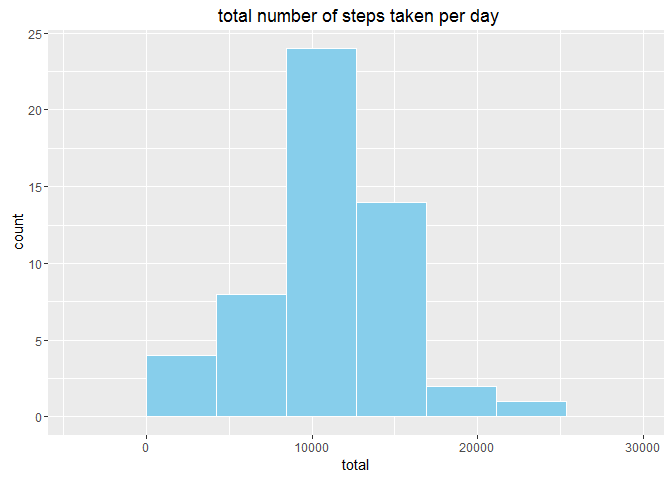
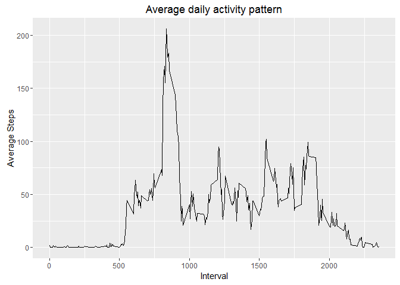
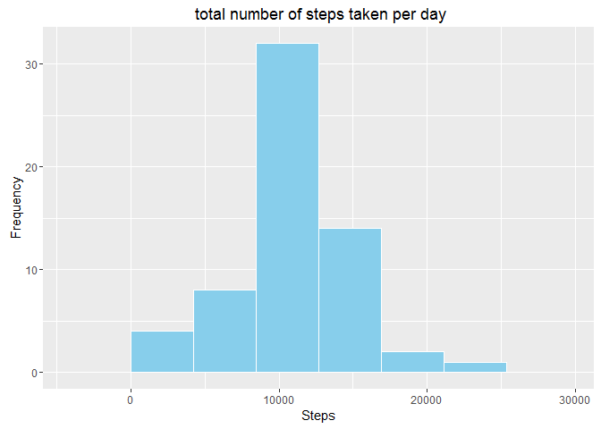
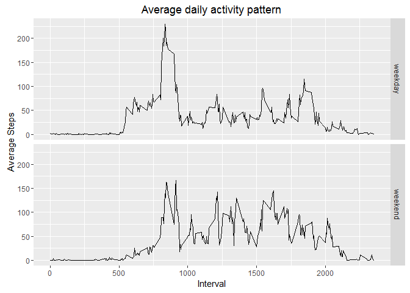

# Reproducible Research: Peer Assessment 1
## Loading and preprocessing the data

```r
require(dplyr)
```

```
## Loading required package: dplyr
```

```
## 
## Attaching package: 'dplyr'
```

```
## The following objects are masked from 'package:stats':
## 
##     filter, lag
```

```
## The following objects are masked from 'package:base':
## 
##     intersect, setdiff, setequal, union
```

```r
require(ggplot2)
```

```
## Loading required package: ggplot2
```

## Loading and preprocessing the data

```r
# Read input file
activity <- read.csv("activity.csv")

# Tally total steps by day
dailyActivity <- activity %>% 
  select(date, steps) %>% 
  group_by(date) %>% 
  filter(!is.na(steps)) %>%
  summarise(total = sum(steps))

# Tally average steps by interval
intervalActivity <- activity %>% 
  select(interval,steps) %>%
  group_by(interval) %>%
  filter(!is.na(steps)) %>%
  summarise(average = mean(steps))
```

## What is mean total number of steps taken per day?

```r
ggplot(data = dailyActivity, aes(x=total)) +
  geom_histogram(bins = 5, fill="skyblue", color="white") +
  labs(title=" total number of steps taken per day", xlab = "Steps", ylab = "Frequency")
```



```r
print(paste("mean: ", mean(dailyActivity$total, na.rm = TRUE)))
```

```
## [1] "mean:  10766.1886792453"
```

```r
print(paste("Median: ", median(dailyActivity$total, na.rm = TRUE)))
```

```
## [1] "Median:  10765"
```

## What is the average daily activity pattern?

```r
ggplot(data=intervalActivity, aes(x=interval, y=average)) +
  geom_line(na.rm=TRUE) + 
  labs(title="Average daily activity pattern") +
  xlab("Interval") +
  ylab("Average Steps")
```



```r
print(paste("interval with maximum number of steps :", 
      intervalActivity %>% filter(average==max(average)) %>% select(interval)))
```

```
## [1] "interval with maximum number of steps : 835"
```

```r
print(paste("maximum number of steps :", max(intervalActivity$average)))
```

```
## [1] "maximum number of steps : 206.169811320755"
```

## Imputing missing values

total number of missing value in each column

```r
colSums(is.na(activity))
```

```
##    steps     date interval 
##     2304        0        0
```


Fill NA with the average activity within the same interval

```r
cleanActivity <- activity
naidx <- is.na(cleanActivity$steps)
intervalidx <- cleanActivity[naidx, "interval"]
averageInterval <- sapply(intervalidx, function(x){mean(cleanActivity[cleanActivity$interval==x,"steps"], na.rm=T)})
cleanActivity[is.na(cleanActivity$steps),"steps"] <- floor(averageInterval)

dailyActivity <- cleanActivity %>% 
  select(date, steps) %>% 
  group_by(date) %>% 
  summarise(total = sum(steps))

ggplot(data = dailyActivity, aes(x=total)) +
  geom_histogram(bins = 5, fill="skyblue", color="white") +
  labs(title=" total number of steps taken per day") +
  xlab("Steps") + 
  ylab("Frequency")
```



```r
print(paste("mean: ", mean(dailyActivity$total)))
```

```
## [1] "mean:  10749.7704918033"
```

```r
print(paste("Median: ", median(dailyActivity$total)))
```

```
## [1] "Median:  10641"
```

## Are there differences in activity patterns between weekdays and weekends?

```r
weekend <- weekdays(strptime(cleanActivity$date, format = "%Y-%m-%d")) %in% c("Saturday","Sunday")
cleanActivity[weekend,"weekInd"] <- "weekend"
cleanActivity[!weekend,"weekInd"] <- "weekday"

# Tally average steps by interval
intervalActivity <- cleanActivity %>% 
  select(weekInd, interval, steps) %>%
  group_by(weekInd, interval) %>%
  summarise(average = mean(steps))

ggplot(data=intervalActivity, aes(x=interval, y=average)) +
  geom_line() + 
  facet_grid(weekInd ~ .) +
  labs(title="Average daily activity pattern") + 
  xlab("Interval") +
  ylab("Average Steps")
```



During weekday, activity pattern show earlier activity in the morning. However, during weekend the person are more active through out the day
